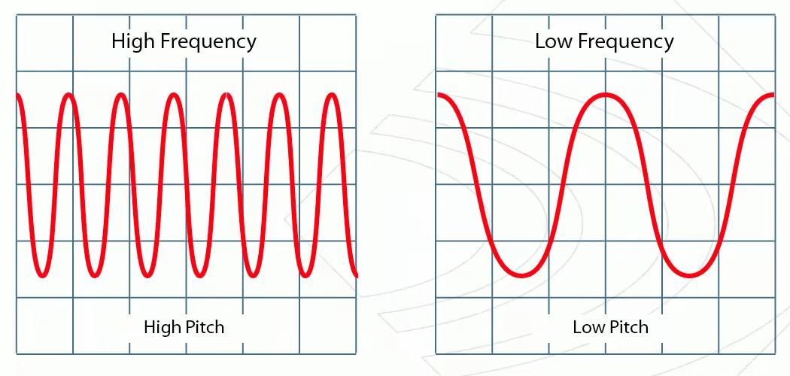
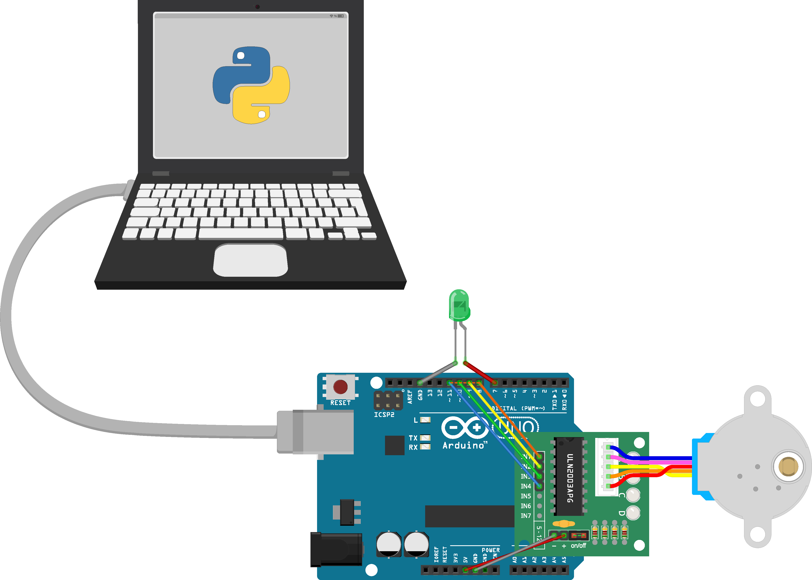

# Prototipo de Afinador Automático de Guitarra

  Este repositorio público documenta los detalles técnicos de la construcción de un afinador automático de guitarra utilizando una placa Arduino UNO y otros accesorios comunes. La documentación incluye los detalles del hardware, con sus componentes y circuitos, así como el software para controlarlo. 
  
  Este prototipo de afinador automático de guitarra se desarrolló en el marco de la materia “Herramientas informáticas y nuevas tecnologías”, dictada como materia optativa en la Facultad de Ciencias Exactas de la UNCPBA, para optar por la aprobación/promoción de dicha asignatura. El plan de la materia busca introducir a los estudiantes en conocimientos básicos de programación, sistemas electrónicos de automatización (particularmente Arduino) y diseño e impresión 3D, promoviendo en todo momento la cultura del software libre. Con el objetivo de evaluar los conocimientos adquiridos durante la cursada, la propuesta de este proyecto busca que nosotros (los estudiantes) abordemos al menos dos de los contenidos mencionados previamente de la materia, llevando adelante así una etapa inicial de prototipado durante el transcurso de dos semanas. Los recursos materiales necesarios para llevar a cabo el proyecto fueron proporcionados por la cátedra o podían ser provistos por los propios alumnos.
  
  Debido a todas estas razones, el proyecto completo no requiere de grandes conocimientos de programación, electrónica ni diseño 3D. Preferentemente, en caso de querer entender el funcionamiento del equipo con más detalle, es necesario un conocimiento básico en física y matemática, particularmente de sonido, frecuencias y su relación con la transformada de Fourier. 

## Índice
 ➤ [Marco teórico](https://github.com/Chamil01/Prototipo-de-Afinador-Automatico-de-Guitarra-/tree/main#marco-te%C3%B3rico)
  
 ➤ [Afinador de guitarra atomático](https://github.com/Chamil01/Prototipo-de-Afinador-Automatico-de-Guitarra-/tree/main#afinador-de-guitarra-autom%C3%A1tico) 
   * [Funcionamiento](https://github.com/Chamil01/Prototipo-de-Afinador-Automatico-de-Guitarra-/tree/main#funcionamiento)
   * [Lista de componentes y software necesario](https://github.com/Chamil01/Prototipo-de-Afinador-Automatico-de-Guitarra-/tree/main#lista-de-componentes-y-software-necesario)
   * [Circuito](https://github.com/Chamil01/Prototipo-de-Afinador-Automatico-de-Guitarra-/tree/main#circuito)
   * [Código](https://github.com/Chamil01/Prototipo-de-Afinador-Automatico-de-Guitarra-/tree/main#c%C3%B3digo)
   * [Diseño 3D](https://github.com/Chamil01/Prototipo-de-Afinador-Automatico-de-Guitarra-/blob/main/README.md#dise%C3%B1o-3d)
   * [Ensamblaje](https://github.com/Chamil01/Prototipo-de-Afinador-Automatico-de-Guitarra-/tree/main#ensamblaje)
   * [Uso](https://github.com/Chamil01/Prototipo-de-Afinador-Automatico-de-Guitarra-/tree/main#uso)
    
➤ [Conclusiones y trabajo a futuro](https://github.com/Chamil01/Prototipo-de-Afinador-Automatico-de-Guitarra-/tree/main#conclusiones-y-trabajo-a-futuro)

➤ [Agradecimientos](https://github.com/Chamil01/Prototipo-de-Afinador-Automatico-de-Guitarra-/tree/main#agradecimientos))

➤ [Contacto](https://github.com/Chamil01/Prototipo-de-Afinador-Automatico-de-Guitarra-/blob/main/README.md#contacto)

## Marco teórico
Antes de adentrarnos en el mundo de la música, las notas e instrumentos, es fundamental comprender el fenómeno esencial que lo hace posible: el sonido. Desde la física, lo que llamamos sonido, no son más que perturbaciones que viajan a través de medios materiales y nuestros oídos pueden percibir. Estas perturbaciones nacen en cierta región del espacio y se propagan a través de él como una **onda**. Las ondas sonoras se generan gracias a una fuente vibrante, como una cuerda de guitarra o las cuerdas vocales de un cantante, la cual produce variaciones de presión en el medio circundante. 

El sonido tiene diversas características que lo definen y le dan personalidad. Una de estas características es la frecuencia, que determina la altura del sonido. La frecuencia se mide en Hertz (Hz) y está relacionada con la cantidad de ciclos completos de vibración que ocurren en un segundo. Un sonido de alta frecuencia se percibe como agudo, mientras que uno de baja frecuencia se percibe como grave.
Entonces, ¿Cómo se relaciona la física con la música? Prácticamente todos estamos familiarizados con la famosa secuencia de notas musicales: DO-RE-MI-FA-SOL-LA-SI-DO. Aunque muchos de nosotros no seamos capaces de identificar específicamente qué nota se está reproduciendo al escucharla, nuestros oídos sí pueden distinguir que no son idénticas. Surge entonces la pregunta: ¿Qué diferencia por ejemplo a un DO de un LA? Y si las notas se repiten en un instrumento, ¿por qué puedo tener dos notas iguales pero una suena más aguda que la otra? La respuesta radica en la frecuencia.

Cada nota musical corresponde a una frecuencia específica de vibración. Cuando se toca una cuerda de una guitarra o se emite un sonido vocal, la frecuencia de vibración de la fuente sonora es la que determina la nota que se produce. Por ejemplo, un DO central en un piano tiene una frecuencia de aproximadamente 261.63 Hz, mientras que un LA central tiene una frecuencia de alrededor de 440 Hz. Esta diferencia en las frecuencias se traduce en una diferencia en la altura percibida de las notas: el DO suena más grave que el LA. La frecuencia también explica porque puedo tener dos o más versiones de una misma nota, donde una sea más aguda que la otra. Esto en música es lo que se conoce como octavas, dos notas forman una octava cuando la frecuencia de una de las dos notas es el doble que el de la otra.
En la práctica, los sonidos vienen acompañados de muchas frecuencias. Particularmente hablando de instrumentos musicales, la frecuencia fundamental (la frecuencia más baja presente en el sonido y a la cual asociamos la nota músical) viene acompañada de un conjunto de frecuencias llamadas armónicos. Estos armónicos tienen valores concretos y varían entre instrumentos (esta es una de las características que hace que un DO en una guitarra suene distinto de un DO en un piano, o en un violín).

Llegamos así a que, si queremos determinar cuál es el nombre de una nota musical emitida por cierto instrumento, bastará (desde la física) con determinar cuál es la frecuencia fundamental de dicha onda sonora. Lamentablemente detectar frecuencias no es una tarea tan directa: cuando uno graba sonidos utilizando un micrófono, lo que obtiene son variaciones en la intensidad de la onda en función del tiempo (intuitivamente se puede pensar como un registro de cómo cambia el volumen del sonido). La información sobre la/s frecuencia/s de la onda está codificada en esas variaciones de intensidad, y para extraerla necesitamos de una herramienta matemática muy importante: la transformada de Fourier.

En palabras sencillas, y sin entrar en demasiados detalles matemáticos, la transformada de Fourier es una técnica que nos ayuda a analizar el contenido de frecuencias de una señal, o sea nos permite descomponer esa señal en diferentes componentes de frecuencia. Anteriormente mencionamos que, si grabamos un sonido con un micrófono, obtendremos una representación de una señal de intensidad en función del tiempo, en este caso estamos trabajando en lo que se conoce como “dominio temporal”. Pero a veces, queremos entender qué frecuencias están presentes en ese sonido, es decir, qué notas o tonos forman parte de esa señal. Es ahí donde entra en juego la Transformada de Fourier. Lo que hace es tomar esa señal en el dominio temporal y transformarla en una representación en el dominio de las frecuencias. En otras palabras, nos permite ver qué componentes de frecuencia están presentes en la señal.

Teniendo esta breve introducción sobre el sonido, las notas musicales y cómo se relacionan con las frecuencias, es momento de adentrarnos en el armado y funcionamiento del afinador automático de guitarra.

## Afinador de guitarra automático
### Funcionamiento
Sabemos, de la experiencia cotidiana, que cuando tocamos la cuerda de una guitarra, esta emite un sonido; lo que nos interesa a nosotros es la _frecuencia fundamental_ en ese sonido. Para que el afinador funcione correctamente, debemos determinar en qué frecuencia está sonando cada cuerda. Luego, comparamos el valor obtenido con aquel que caracteriza a la cuerda accionada. En base a esta comparación, se decidirá si se debe tensar o destensar la cuerda; este paso será realizado con el motor paso a paso.

El sonido emitido por la cuerda de la guitarra es captado por el micrófono de la computadora, la cual está conectada la placa Arduino. Para determinar la frecuencia dominante del sonido registrada, es necesario realizar una transformada rápida de Fourier de los datos obtenidos de la señal registrada. En condiciones ideales, al realizar dicha transformada, el primer pico que aparezca corresponderá a la frecuencia con la que está sonando la cuerda de la guitarra; este dato es el que se compara luego con la frecuencia a la que debería sonar una cuerda afinada. En una guitarra, la frecuencia de afinación estándar de cada cuerda es:

<table align="center">
  <tr>
    <th>Cuerda</th>
    <th>Frecuencia</th>
  </tr>
  <tr>
    <td>1ra</td>
    <td>329.63 Hz</td>
  </tr>
  <tr>
    <td>2da</td>
    <td>246.94 Hz</td>
  </tr>
  <tr>
    <td> 3ra </td>
    <td>196.00 Hz</td>
  </tr>
  <tr>
    <td>4ta</td>
    <td>146.83 Hz</td>
  </tr>
  <tr>
    <td>5ta</td>
    <td>110.00 Hz</td>
  </tr>
  <tr>
    <td>6ta</td>
    <td>82.40 Hz</td>
  </tr>
</table>

Al comparar el dato obtenido con los exhibidos en la tabla, podremos determinar la acción que debe realizar el motor accionando sobre las clavijas. Si la frecuencia registrada por el micrófono es menor a la tabulada, el motor debe tensar la cuerda, caso contrario, debe destensarla. Para encastrar el afinador en el instrumento, se utiliza una pieza diseñada e impresa en 3D que conecta el motor con la clavija de la guitarra.

Una vez que afinamos una cuerda, el programa, mediante una luz LED, avisa al usuario que debe pasar a la siguiente cuerda; así sucesivamente hasta afinar por completo el instrumento.

### Lista de componentes y software necesario
 * 🟢 Placa Arduino UNO **x 1**.
 * 🟢 Circuito integrado ULN2003 **x 1**.
 * 🟢 Motor paso a paso 28BYJ-48 **x 1**.
 * 🟢 Luz LED **x 1**.
 * 🟢 Cables Dupont macho-hembra **x 8**.
 * 🟢 Pieza impresa en 3D que conecta el motor con la clavija de la guitarra **x 1**.
 * 🟢 Arduino IDE.
 * 🟢 Python.
 * 🟢 FreeCAD.
 * 🟢 Ultimaker CURA.

### Circuito

Como vemos en la imagen, utilizamos el circuito integrado ULN2003 para conectar el motor paso a paso con la placa Arduino UNO. El extremo positivo de este circuito, se conecta a 5V, mientras que el negativo se conecta a GND (tierra). Los pines IN, se conectan hacia los pines digitales de la placa Arduino de la siguiente manera: IN1 se conecta al pin 8, IN2 se conecta al pin 9, IN3 se conecta al pin 10 e IN4 se conecta al pin 11. Adicionalmente, conectamos el ánodo de la luz LED (extremo más largo) al pin digital 7 y el cátodo a GND. Finalmente, conectamos la placa Arduino UNO a la computadora. 

### Código

Todos los códigos están en [esta carpeta](https://github.com/Chamil01/Prototipo-de-Afinador-Automatico-de-Guitarra-/tree/main/Afinador/Software%20y%20m%C3%A1s).

El archivo [DetectorDeFrecuencia (Python).py](https://github.com/Chamil01/Prototipo-de-Afinador-Automatico-de-Guitarra-/blob/main/Afinador/Software%20y%20m%C3%A1s/DetectorDeFrecuencia%20(Python).py) es el encargado de registrar el sonido de la cuerda sonando y procesarlo para determinar su frecuencia fundamental. El mismo, como bien indica el nombre y el tipo de archivo, fue programado en Python. Para levantar el sonido de la cuerda de la guitarra se importa la biblioteca [“sounddevice”](https://pypi.org/project/sounddevice/), la cual permite utilizar el micrófono de la computadora para grabar sonidos y guardarlos como un array. Para cada grabación se eligió registrar 3s de sonido a una frecuencia de sampleo de 44110Hz, valor mas que suficiente para las frecuencias que estamos intentando detectar (según el [teorema de muestreo de Nyquist](https://www.ni.com/es-cr/shop/data-acquisition/measurement-fundamentals-main-page/analog-fundamentals/acquiring-an-analog-signal--bandwidth--nyquist-sampling-theorem-.html)). Obtenido el array representativo del sonido, se importa la biblioteca [“SciPy”](https://scipy.org/) para usar su función _[rfft()](https://docs.scipy.org/doc/scipy/reference/generated/scipy.fft.rfft.html)_, la cual computa una transformada de Fourier discreta de un array unidimensional cuyos elementos son reales. Realizada la transformada se procede a trabajar con su valor absoluto, y a dicha función se le determinan los picos de frecuencias utilizando la función _[find_peaks](https://docs.scipy.org/doc/scipy/reference/generated/scipy.signal.find_peaks.html)_ también de SciPy (los argumentos de dicha función permiten regular la sensibilidad con la que elige los picos). Detectados los picos, se elige el primero de ellos y se determina a que frecuencia corresponde (frecuencia fundamental). Finalmente ese dato es enviado a la placa Arduino mediante comunicación serial, utilizando la biblioteca [“PySerial”](https://pypi.org/project/pyserial/). 

El código [Afinador_Arduino.ino](https://github.com/Chamil01/Prototipo-de-Afinador-Automatico-de-Guitarra-/blob/5466e20655a2cab8c7bc5b39c56c6e8a68fcb78a/Afinador/Software%20y%20m%C3%A1s/Afinador_Arduino/Afinador_Arduino.ino) es el encargado de recibir el dato enviado desde el programa en Python, y determinar en base a ello como debe actuar el motor paso a paso. Este código es cargado en la placa Arduino, y fue programado desde Arduino IDE. Para controlar el motor se importa la biblioteca [Stepper.h](https://www.arduino.cc/reference/en/libraries/stepper/). Dentro de la función _void loop(){}_ se verifica primero si hay algún dato de frecuencia proveniente de [DetectorDeFrecuencia (Python).py](https://github.com/Chamil01/Prototipo-de-Afinador-Automatico-de-Guitarra-/blob/main/Afinador/Software%20y%20m%C3%A1s/DetectorDeFrecuencia%20(Python).py). De ser así, el programa registra dicho valor y luego llama a la función _“CompararFrecuencia(FrecuenciaRecibida, Cuerda)”_. Esta función devuelve un único resultado _“DiferenciaEntreFrecuencias”_ que tiene información tanto, sobre si la frecuencia detectada es mayor o menor que la frecuencia fundamental tabulada (en afinación estándar) de la cuerda correspondiente (dependiendo de si el resultado es positivo o negativo), como también sobre que tan alejada se encuentra de dicho valor. 

Una vez obtenido tal resultado, se evalúa si el mismo está lo suficientemente cerca del valor tabulado para decidir si el motor paso a paso debe o no girar la clavija de la guitarra. Para ello se ve:

- Si el valor absoluto de _DiferenciaEntreFrecuencias_ es menor o igual a 0.7 (valor arbitrario elegido) entonces el programa comunica al usuario (a través de la luz led conectada a la placa) que ya es momento de mover a la siguiente cuerda, registrando dicho cambio en una variable llamada _"Cuerda"_ la cual indica al programa cual cuerda está siendo afinada.
  
- Caso contrario, se le envía ordenes al motor paso a paso para que tense o destense la cuerda. Para ello se llama a la función _“MoverServo(DiferenciaEntreFrecuencias)”_, la cual se encarga de enviarle las indicaciones correspondientes al motor paso a paso según el valor de _DiferenciaEntreFrecuencias_. La función tiene la capacidad de indicarle al motor que gire en proporción a la diferencia entre el valor detectado y el valor tabulado (mientras mayor sea la diferencia mas girará el motor, y viceversa), y de indicarle si debe girar en sentido horario o antihorario.

Habiendo afinado todas las cuerdas, se avisa al usuario de esta situación y el programa es reiniciado para su futuro uso. 

### Diseño 3D
Todos los archivos del diseño 3D se encuentran en [esta carpeta](https://github.com/Chamil01/Prototipo-de-Afinador-Automatico-de-Guitarra-/tree/5fbd1af07adca187633d574ac43939b587aed64f/Afinador/Dise%C3%B1o%203D).

La pieza que une el motor con la clavija de la guitarra fue diseñada en FreeCad e impresa en 3D por nosotros mismos debido a que, como condición del trabajo, debíamos incorporar estos temas en el proyecto; además, teníamos acceso a una impresora 3D. En caso de querer hacerlos y no contar con el conocimiento o artefactos necesarios, se pueden mandar a hacer, incluso de otros materiales.

Para el diseño de la pieza, se utilizó el _Workbench Part_ y las figuras primitivas, ya que la misma no  requería demasiada complejidad. En primer lugar y como estructura base se construyó un cilindro de 30 mm de radio y una altura de 40mm. Para la ranura en donde se encastra el motor, se generó un pequeño rectángulo con las siguientes medidas: 5.04 mm de longitud, 3.04 mm de ancho y 8.04 mm de altura. Este rectángulo se posicionó de modo que quedara centrado con el eje del cilindro y luego se aplicó una operación booleana de corte, de modo que quede un hueco en el cilindro del tamaño del rectángulo generado. Por último, siguiendo el mismo procedimiento, se generó otro rectángulo del lado opuesto cuyas medidas son: 25.04 mm de longitud, 15.04 mm de ancho y 7.04 mm de altura. Nuevamente, se posicionó de modo que quede centrado con el cilindro y se aplicó una operación booleana de corte, de modo que este rectángulo también quede hueco sobre la estructura base. Este último hueco generado es el que encastra con la clavija de la guitarra.

Finalmente, se utilizó Slicer Ultimaker CURA para definir el porcentaje de relleno de la pieza, eligiendo que sea de un 40%. Se determinó este porcentaje con el fin de que no sea algo muy macizo, pero que tampoco sea lo suficientemente liviano como para quebrarse con el torque del motor.

### Ensamblaje

### Uso

El código [Afinador_Arduino.ino](https://github.com/Chamil01/Prototipo-de-Afinador-Automatico-de-Guitarra-/blob/5466e20655a2cab8c7bc5b39c56c6e8a68fcb78a/Afinador/Software%20y%20m%C3%A1s/Afinador_Arduino/Afinador_Arduino.ino) debe ser subido a la placa Arduino UNO. Durante el afinado, la placa debe mantenerse en todo momento conectada a la computadora no solo para utilizarla como fuente de energía, sino también para mantener la conexión serial que utilizamos con el código en Python. Cada vez que vayamos a tocar una cuerda para afinarla debemos ejecutar previamente el archivo [DetectorDeFrecuencia (Python).py](https://github.com/Chamil01/Prototipo-de-Afinador-Automatico-de-Guitarra-/blob/main/Afinador/Software%20y%20m%C3%A1s/DetectorDeFrecuencia%20(Python).py). Previo a utilizarlo es **muy importante** establecer correctamente el puerto serie que estemos empleando, de no hacerlo el programa no logrará comunicarse con la placa Arduino. Al ejecutar el código se imprimirá el mensaje **"Grabando"** en la terminal, lo cual nos indica que es momento de tocar la cuerda de la guitarra. Debido a que el audio registrado dura únicamente 3 segundos, se aconseja al músico no demorar mucho en hacer sonar la cuerda. Para una mejor detección de la frecuencia, se recomienda acercar la guitarra al micrófono la mayor distancia posible con el objetivo de reducir el ruido ambiente y captar correctamente el sonido de la guitarra. También se sugiere tener cuidado en tocar únicamente la cuerda que se desea afinar, o sea evitar, que las frecuencias del resto de las cuerdas interfieran en los resultados.

Con el objetivo de controlar el correcto funcionamiento del código, el programa imprime en pantalla los picos de frecuencia detectados en la transformada de Fourier como una lista. El primero de tales datos, en el caso ideal, debería corresponder a la frecuencia fundamental de la cuerda sonando. Otra etapa de control puede implementarse realizando un _plot_ de la transformada de Fourier en función de las frecuencias (el código para hacerlo está comentado al final del programa). Una vez enviada la frecuencia detectada a la placa Arduino, el programa finaliza y se encuentra listo para volver a ser ejecutado. Recomendamos esperar a que la placa Arduino complete correctamente su trabajo (mover el motor o prender la luz LED) antes de volver a ejecutar el programa en Python. 

En caso de mantener Arduino IDE abierto con el código de la placa, recomendamos no abrir ni imprimir datos en el *"Monitor Serial"*, ya que hacerlo puede interferir con la comunicación serial entre Python y la placa Arduino. También hemos detectado problemas al intentar utilizar el programa con auriculares conectados al ordenador, o en forma simultanea con otro Software que utilice activamente el micrófono de la computadora, como lo puede ser Discord o Google Meet. 

  

## Conclusiones y trabajo a futuro

Al ser un prototipo, el proyecto puede ser mejorado en varios aspectos. Detallaremos a continuación algunas de las dificultades encontradas y posibles implementaciones a futuro para perfeccionar la herramienta:

➡️  _**Detección de sonido:**_ Actualmente, para la grabación y procesado de la señal sonora, es necesario tener una computadora con micrófono conectada a la placa Arduino. Para poder dotar al afinador de portabilidad se tendría que lograr alguna forma de independizar a la placa Arduino y que trabaje por si sola sin necesidad de un computador. Para ello es necesario poder implementar un mecanismo de detección de sonido a la misma placa, el cual debe encargarse tanto de registrar la señal como de procesarla adecuadamente. Una posible alternativa, que funcionaria específicamente para guitarras eléctricas, sería buscar la forma de utilizar la señal captada por los mismos micrófonos de la guitarra (Pastillas o Humbuckers) y enviarla a la placa Arduino a través del cable que se conecta al instrumento. En cualquier caso, sería necesario dotar a la placa Arduino de una batería externa que le brinde energía para independizarse completamente de la computadora como fuente. 

➡️  _**Servomotor:**_ En algunos casos, por no decir la mayoría de ellos, el torque generado por el motor paso a paso 28BYJ-48 no es suficiente como para girar la clavija de la guitarra. Para el correcto funcionamiento del afinador, habría que dotar al afinador de un motor con mayor torque. Una posible alternativa seria el motor paso a paso NEMA 23.

➡️  _**Software:**_ El algoritmo utilizado para detectar la frecuencia fundamental en la transformada de Fourier del sonido de la cuerda falla en varios casos. Ajustar la sensibilidad del algoritmo para que detecte correctamente los picos de frecuencia puede ser una tarea muy engorrosa, ya que de no hacerlo correctamente, puede tanto detectar un exceso de picos donde no los hay (ruido de fondo) como puede ignorar completamente las frecuencias que deseamos detectar. Una posible alternativa seria realizar un llamado “Threshold dinamico”, el cual debería definirse en función de la señal captada y diversos criterios estadísticos. Este threshold seria utilizado luego para filtrar todos los valores que se encuentren por debajo de su valor y quedarnos únicamente con aquellos picos que se destaquen por sobre el resto de datos (frecuencia fundamental y armónicos de la cuerda).
  
   Otro problema relacionado al software es que actualmente hay que ejecutar el programa en Python cada vez que vamos a tocar una cuerda para afinarla. Lo ideal seria encontrar una manera de detectar automáticamente si una cuerda está siendo o no tocada para ser afinada, lo cual requiere un trabajo mas complejo ya que habría que idear una forma de descartar sonidos de fondo no deseados que puedan actuar como trigger. Una posibilidad, en caso de lograr independizar la placa Arduino del ordenador, seria utilizar el sensor de sonido KY-038. Este sensor está dotado de una salida digital que envia un 1 o un 0 en función de si detecta que hay o no sonido en el ambiente, además de que permite regular su sensibilidad mediante el ajuste de un potenciometro implementado. 
   
   Finalmente, en caso de lograr esta automatización, se debería evaluar una forma para que el programa no envíe tareas al motor paso a paso si este se encuentra en movimiento, evitando así posibles comportamientos no deseados. 
   
➡️ _**Versatilidad:**_ Por el momento el prototipo solo es capaz de realizar una afinación estándar del instrumento. Una buena idea a futuro seria implementar alguna forma de que el usuario pueda elegir de antemano la afinación que desea para la guitarra (sin necesidad de modificar el código). 

## Agradecimientos
Queremos agradecerle al Centro Universitario de Innovación Ciudadana (CUIC), perteneciente a la Facultad de Ciencias Exactas de la UNCPBA, por prestarnos las instalaciones del espacio maker, por ayudarnos con el diseño 3D cuando tuvimos dificultades y por imprimirnos la pieza 3D sin ningún costo. 

## Contacto

#### Cherenscio, Camilo
  * 👤 [Linkedin](https://www.linkedin.com/in/camilo-cherenscio-4338a6282/)
  * 📧 ccherenscio@alumnos.exa.unicen.edu.ar

#### Labaroni, Sol
  * 👤 [Linkedin](https://www.linkedin.com/in/sol-labaroni-2387a8207/)
  * 📧 sol.labaroni.sl@gmail.com

Sugerencias, correcciones y preguntas son mas que bienvenidas. 

